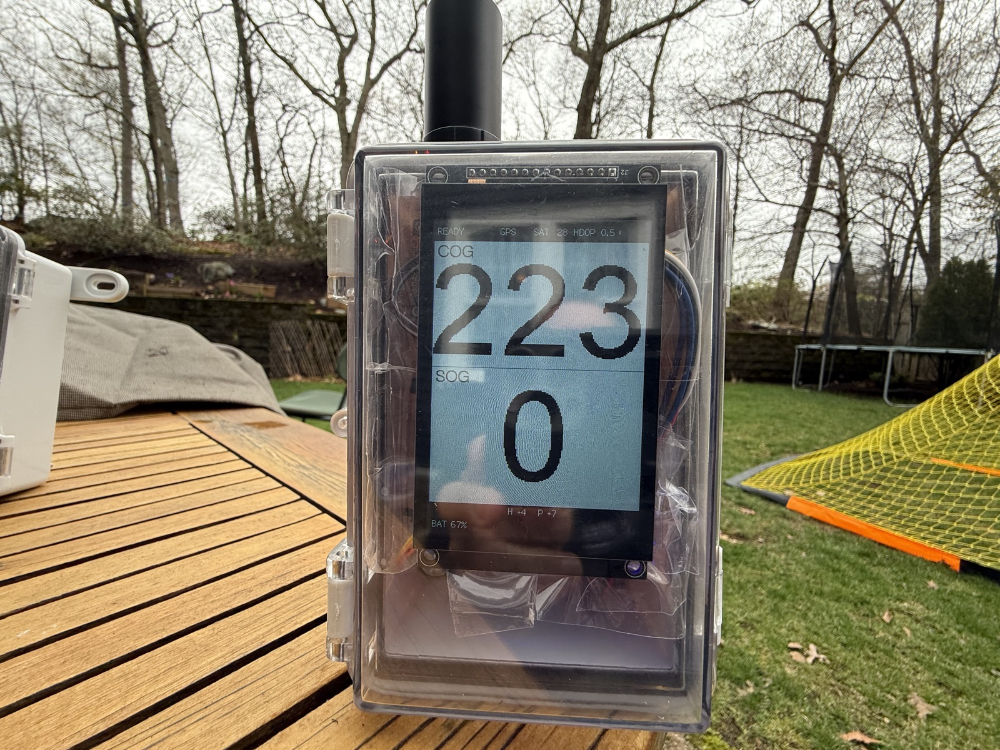
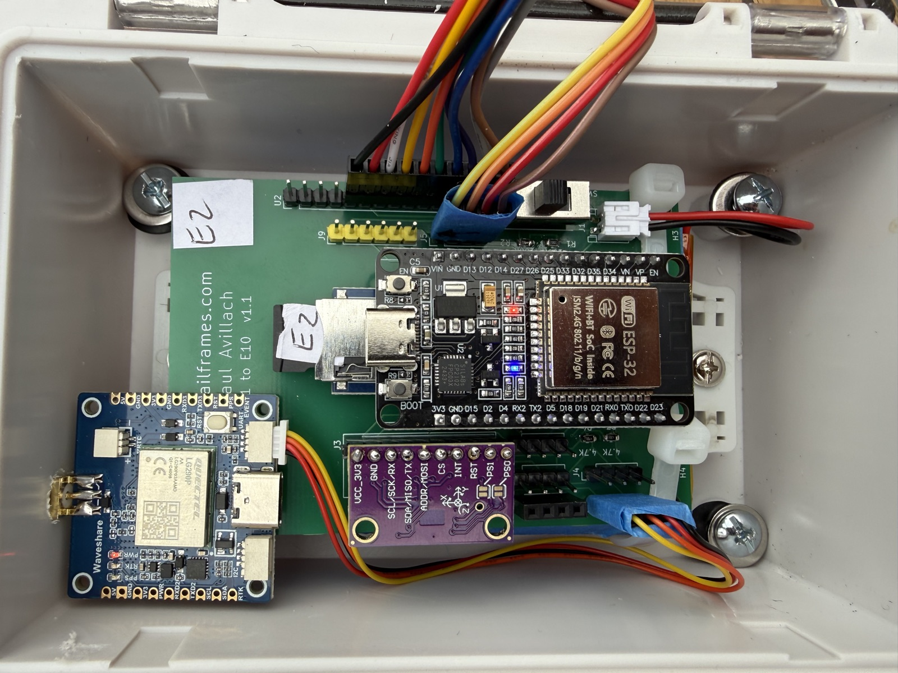
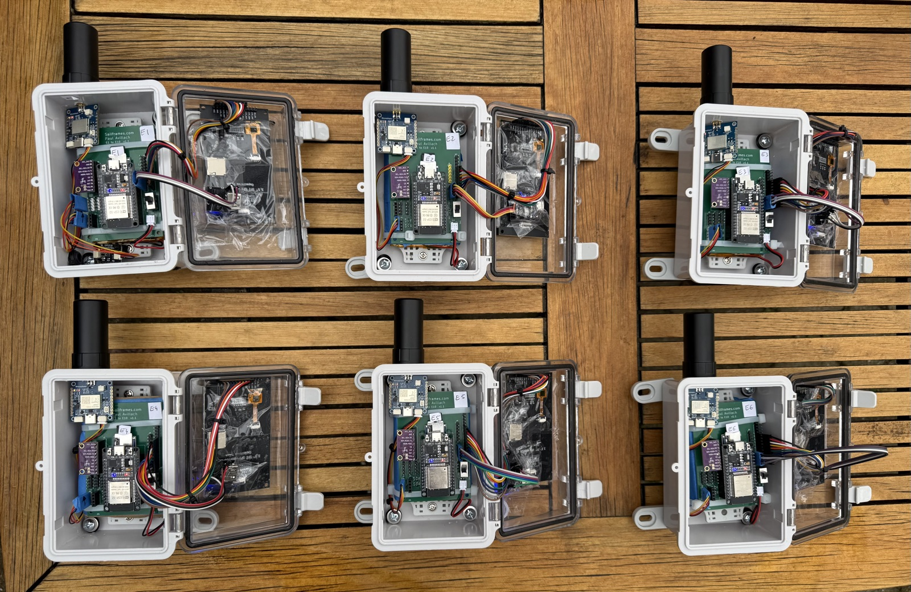

# SailFrames — Sailboat Racing Data Logger

## Project Context for Claude Code

**Note:** S1 (Raspberry Pi single-boat analysis device) was shelved.
All S1 hardware/software notes live in `docs/S1_LEGACY.md`. This file
is focused on the deployed system: ESP32 **E1** fleet trackers (×6) and
the web race dashboard.

---

## Project Overview

**SailFrames** is an open-source sailboat racing data logger and analytics platform.

- **License:** Apache 2.0
- **GitHub org:** github.com/sailframes
- **Main repo:** github.com/sailframes/core
- **Domain:** sailframes.com (AWS-hosted)
- **Cloud:** AWS (S3 + Lambda + CloudFront + Route 53)
- **S3 bucket:** `sailframes-fleet-data-prod`
- **Fleet:** 6 boats — Sonar 23 / J/80 class, Boston Harbor

The fleet captures GPS + IMU + (some) wind during races, uploads to S3
post-sail, and provides a web dashboard for race replay and analytics.

**Strategic focus:** SailFrames is a 10 Hz high-precision GNSS + IMU
motion-analytics platform for sailing. Per-tack motion, real-time OCS
(over-the-line detection at race start), and detailed playback drive
the product. Raw-RTCM3 PPK was tested through firmware
`2026.05.20.08` and retired in `.09` — see `docs/RTCM_PPK_ARCHIVE.md`
for the previous architecture if we revisit it.

---

## Repository Structure (Monorepo)

```
sailframes/core/
├── CLAUDE.md              # This file — E1 + web project context
├── docs/
│   └── S1_LEGACY.md       # Shelved Raspberry Pi notes
├── edge-e/                # ESP32 device (E1 = first gen)
│   ├── hardware/          # KiCad PCB v1.1 (Gerbers ordered)
│   └── firmware/          # ESP32 Arduino firmware (sailframes_edge.ino — unified E + B)
├── edge-s/                # LEGACY — Raspberry Pi (see docs/S1_LEGACY.md)
├── web/                   # Race dashboard
│   ├── api/               # FastAPI backend
│   ├── assets/            # JS / CSS for dashboard pages
│   ├── *.html             # race.html, sessions.html, etc.
│   └── frontend/          # (legacy React, mostly deprecated)
├── processing/            # Python analytics (maneuvers, polar, stats)
├── lambda/                # AWS Lambda (post-upload processing, APIs)
├── infrastructure/        # CDK/Terraform + deploy.sh
├── scripts/               # Utility scripts (flash-edge.sh, sync, repro)
├── export/                # Report / video export
└── .github/workflows/     # CI: firmware-edge.yml builds the .bin on push
```

---

## E1 Hardware Stack (ESP32 Fleet Tracker)

<p align="center">
  
  
  
</p>
<p align="center"><sub>
  Left: in use, sunlight-readable TFT. ·
  Centre: internals on PCB v1.1. ·
  Right: the fleet of six.
</sub></p>

| Component | Part | Interface | Notes |
|---|---|---|---|
| MCU | ELEGOO ESP32 DevKit V1 (CP2102) | USB-C | Dual-core 240 MHz, Wi-Fi + BLE |
| GPS | Waveshare LG290P GNSS module | UART2 (GPIO16/17) | Quad-band, 10 Hz NMEA (Rover mode), ~$109 with antenna |
| IMU | GY-BNO08X (BNO085) | I2C (GPIO21/22) @ 0x4A | Heel/pitch, GAME_ROTATION_VECTOR mode |
| Display | Hosyond 3.5" IPS TFT (ST7796U) | SPI VSPI (480×320) | Sunlight-readable, white background |
| Storage | microSD module | SPI HSPI (separate bus) | CSV per-sensor (nav/imu/wind/pres) |
| Power | DWEII USB-C 5V 2A boost charger | 5V → ESP32 VIN | LiPo charging + protection + boost |
| Battery | 906090 3.7V 6000 mAh LiPo | JST PH 2.0 mm | ~10+ hours runtime |
| Enclosure | YETLEBOX IP67 ABS clear lid | — | Daily install/remove |
| Wind (one boat) | Calypso Ultrasonic Portable Mini | BLE 5.1 | Apparent wind; only on E1 currently |

Future expansion (PCB headers): wind UART1 (GPIO32/33), I2C connectors
for DPS310 / extras, GPIO header (D26, D15, VP, VN).

### Power Management

- DWEII boost charger handles LiPo charge + 5V boost
- SPDT slide switch on boost-output → ESP32 VIN
- Battery monitoring: GPIO34 ADC via 2× 100KΩ voltage divider
- Battery % shown on bottom bar of TFT

### E1 Wiring Summary

**TFT (VSPI) and SD (HSPI) MUST be on separate SPI buses** — sharing one
bus causes severe display flicker during SD writes.

```
LG290P GPS (UART2):
  TXD3 → GPIO16 (RX2)  ⚠ NOT GPIO21/22 (those are I2C)
  RXD3 → GPIO17 (TX2)
  5V → boost-module 5V, GND → GND

BNO085 IMU (I2C):
  SDA → GPIO21,  SCL → GPIO22
  VCC → 3V3 from ESP32, GND → GND

TFT ST7796U (VSPI):
  MOSI → GPIO23, MISO → GPIO25 (swapped with BL),
  CLK → GPIO18, CS → GPIO5, DC → GPIO2, RST → GPIO4,
  BL → GPIO19 (swapped with MISO),  VCC → 3V3, GND → GND

SD card module (HSPI — SEPARATE from TFT):
  CLK → GPIO14, MISO → GPIO35 (input-only, avoids GPIO12 strapping issue),
  MOSI → GPIO13, CS → GPIO27, VCC → 3V3, GND → GND

Battery:
  Boost OUT+ → SPDT switch → ESP32 VIN
  Boost OUT- → GND
  LiPo B+ → boost B+, also → 100K → GPIO34 → 100K → GND
  LiPo B- → boost B-

Future expansion:
  Wind UART1: GPIO32 (RX), GPIO33 (TX)
  I2C expansion: shared bus on GPIO21/22
  GPIO expansion: GPIO26, GPIO15, VP (GPIO36), VN (GPIO39)
```

### KiCad PCB v1.1

**Status:** Gerbers ordered from JLCPCB (April 18, 2026).
**Specs:** 60.5 × 91.5 mm, 2-layer, 1.6 mm, green solder mask.
**Files:** `edge-e/hardware/kicad_sailframes-e1/`

Connectors: ESP32 DevKit V1 (U1), TFT (U2), SD module (J1),
LG290P GPS (J2), BNO085 (J3), DPS310 (J4 future), boost module (J5),
I2C expansion (J6/J7), wind sensor (J8), GPIO expansion (J9),
battery JST (J10), SPDT power switch (SW1), voltage divider 2×100KΩ
(R1/R2), I2C pull-ups 2×4.7KΩ (R3/R4).

Layout: ground pour on B.Cu for EMI, 4× M2.5 mounting holes at corners,
Freerouting + manual cleanup.

---

## Edge Firmware (`edge-e/firmware/sailframes_edge/sailframes_edge.ino`)

> Single unified firmware for **both E (LG290P) and B (LC29HEAMD) devices**; branches on
> `config.hardware_platform`. Renamed from `sailframes_e1` 2026-06-02 to end the E-only
> confusion. CI: `.github/workflows/firmware-edge.yml`; flash: `scripts/flash-edge.sh`.

- NMEA parsing (GGA/RMC/GSA/GSV) from LG290P at **10 Hz** (Rover mode)
- BNO085 reports at **10 Hz** (was 1 Hz pre-`.05`; baked into firmware
  since `.05`. 10 Hz IMU + 10 Hz GNSS pair for accurate OCS and tack
  analysis)
- DPS310 pressure at 0.1 Hz (weather trends; not gust detection)
- SD logging: CSV per sensor (human-readable). RTCM3 raw capture
  retired in `.09` — see `docs/RTCM_PPK_ARCHIVE.md`
- TFT: speed/COG huge, status bar, Vakaros-style white background
- Battery monitoring (GPIO34 ADC + voltage divider)
- Wi-Fi auto-upload to S3 over plain HTTP on yacht-club / Home-IOT detection
- GPS-speed-triggered auto-start (>1.5 kt sustained ≥10 s). **No auto-stop** —
  recording continues until the operator powers off via the SPDT slide
  switch or sends `stoprec` over serial/telnet. Speed-based auto-stop was
  removed 2026-05-12 because boats routinely sit at low speed (tactics,
  pre-start, between starts) and the 3-minute sustained-<0.5-kt stop was
  chopping sessions mid-race. Pending files upload on next boot via the
  stationary-upload path (which fires while `!logging`)
- Power-button toggle of recording
- Configuration via SD `config.txt`, optionally pushed via S3 (Stage 3.6 —
  see "v2.0.0 race-operations stack")
- ESP-NOW peer mesh @ 2 Hz boat-state broadcast, always-on after WiFi PHY
  init (Stage 2). Wire types in `mesh.h`; FNV-1a hash of `boat_id` is the
  stable cross-boot sender identity
- Boat-local OCS state machine (Stage 4) + RC-side fleet OCS aggregation
  with `MSG_INDIVIDUAL_RECALL` broadcast (Stage 5). Per-class bow_offset
  registry in `/sf/classes.csv` (Stage 5.5)

### Pinned library / core versions (do NOT auto-update)

- ESP32 board package **3.3.7** (3.3.8 breaks I2C and TFT)
- TFT_eSPI (latest)
- NimBLE-Arduino **2.4.0** (2.5.0 has BLE/WiFi switching issues)
- Adafruit BusIO 1.17.4
- Adafruit GFX 1.12.6
- Adafruit BNO08x 1.2.5
- Adafruit DPS310 1.1.3

**Partition scheme:** `Minimal SPIFFS (1.9 MB APP with OTA / 128 KB SPIFFS)`.
This keeps OTA partitions for any future firmware-pull mechanism. Do NOT
use `huge_app` — it disables OTA.

### TFT layout (D2)

Row 1 (y=440, font 2): heel + pitch + AWS + AWA when wind connected;
heel + pitch alone when no wind sensor. Single row.

Row 2 (y=458): left = `BAT N% [W] FW<YY.MM.DD.N>`, right = WiFi
indicator + IP (when idle) or upload counter (`N<count>` sessions
with files pending, or `<n>/<total>` during active upload).

### Serial / telnet commands

| Command | Description |
|---------|-------------|
| `start` / `stop` | Manual start/stop recording |
| `recstate` | Show recording state |
| `upload` | Trigger Wi-Fi upload |
| `clearmarkers` | Delete `.uploaded` markers (retry uploads) |
| `cleanup` | Delete already-uploaded files |
| `status` | GPS/IMU/SD/WiFi/battery snapshot |
| `gps` / `gpsraw` / `gpscfg` | GPS debug |
| `config` / `configver` | Show config / config version + boat_id + FW |
| `update` / `ota` | Manual auto-OTA pull from S3 manifest |
| `telneton` / `telnetoff` | Enable/disable runtime telnet listener |
| `role` / `hwid` / `flags` / `radiomode` | v2.0.0 foundation introspection |
| `mesh` | ESP-NOW peer-mesh status + per-peer telemetry |
| `statusup` | Force `_health.json` snapshot upload |
| `configsync` | Fetch + apply cloud config from S3 (reboots if newer) |
| `ocs` | Show boat-local OCS state |
| `race arm <pin_lat> <pin_lon> <rc_lat> <rc_lon> <secs>` | Arm OCS + broadcast `MSG_RACE_ARMED` to fleet |
| `race disarm` / `race off` | Disarm local OCS |
| `fleet` | RC view of per-peer distance + OCS state (role=`rc_signal` only) |
| `classes` | Show `/sf/classes.csv` bow_offset registry (RC-only) |

Telnet listener defaults **OFF** — its `WiFiServer.hasClient()` calls
deadlocked Core 1 inside LWIP under upload contention (firmware
2026.05.03.04 fleet hang). Enable with `telneton` for live debug.

### SD card layout

```
/sf/
├── 20260405_225030/                # Session folder (GPS datetime)
│   ├── E1_20260405_225030_nav.csv  # NMEA parsed @ 10 Hz
│   ├── E1_20260405_225030_imu.csv  # BNO085 @ 10 Hz
│   ├── E1_20260405_225030_wind.csv # Calypso @ 1 Hz
│   └── E1_20260405_225030_pres.csv # DPS310 @ 0.1 Hz
├── boot.log                         # Reset reason / heap per boot
├── config.txt
├── config.txt.prev                  # One-deep backup from last cloud config apply
├── classes.csv                      # Per-class bow_offset registry (RC-only; optional)
├── ocs_disagree.log                 # RC-vs-boat OCS divergence log (one line per recall)
└── wind_mac.txt                     # Calypso MAC; presence = wind enabled
```

### `boot.log` format (since 2026.05.03.08, extended 2026.05.05.01 / .08)

Each boot appends one line at setup time:
`boot fw=<ver> reset=<reason> heap=<free> min_heap=<min>`
where `reset` is one of `POWERON / SW / PANIC / TASK_WDT / INT_WDT / BROWNOUT / DEEPSLEEP / EXT`.
Note: with the SPDT slide switch wiring, every clean session shows `POWERON`
— the reset reason alone cannot distinguish "battery died" from "user
toggled switch". Use the timestamped lines below for that.

Once GPS time becomes valid in a given session, one extra line is appended:
`session t=<iso> batt=<v>V <pct>%`

Every 5 minutes the diagnostics task appends a heartbeat:
`alive t=<iso> batt=<v>V <pct>% heap=<free>`

Auto-OTA + watchdog markers (since 2026.05.05.08):
```
ota start
ota end ok                                  ← clean OTA path (same-version no-op or successful download+restart)
ota end fail                                ← any failure exit (timeout, SHA mismatch, write error)
ota watchdog: deadline exceeded at sect=…   ← diag task killed a stuck OTA past 180 s (forces SW reset)
loop watchdog: Core 1 stuck at sect=… for Nms — restart    ← diag task killed a wedged Core 1 (90 s no g_loopIter movement)
```

Reading the log:
- Last `alive` before next `boot` = device's last known good moment.
- Gap of seconds → user power-off. Gap of minutes with healthy `batt%` →
  crash. Gap with `batt%` already below ~10% → battery died.
- A `*watchdog: …` line followed by `boot reset=SW` = a soft hang
  was caught and self-recovered. The `sect=` value names the
  exact `g_loopSection` Core 1 was inside when it died.
- Synchronised silent deaths across multiple boats at the same
  wall-clock moment = shared external trigger (WiFi reconnect,
  AP association, etc.) — see gotcha #22.

---

## E1 Wi-Fi Upload Architecture

ESP32 Arduino Core 3.3.7 has broken TLS (mbedTLS BIGNUM allocation
failures). The E1 uploads **directly to S3 over plain HTTP**, bypassing
API Gateway entirely.

**Endpoint:**
```
http://{bucket}.s3.{region}.amazonaws.com/raw/E1/{date}/{filename}
```

**Flow:**
1. E1 connects to known Wi-Fi (yacht club / Home-IOT)
2. DNS + TCP test to S3 on port 80
3. HTTP PUT direct to S3
4. Bucket policy allows unauthenticated PUT to `raw/E1/*` paths

**S3 bucket policy snippet:**
```json
{
  "Sid": "FleetDirectHTTPUpload",
  "Effect": "Allow",
  "Principal": "*",
  "Action": "s3:PutObject",
  "Resource": "arn:aws:s3:::sailframes-fleet-data-prod/raw/*"
}
```

**Markers:** After each successful PUT we create `<filename>.uploaded` so
retries skip done files. `clearmarkers` over serial wipes them.

**Why HTTP, not HTTPS:** ESP32 TLS is fundamentally broken in 3.3.7
("RSA - public key operation failed: BIGNUM - Memory allocation failed").
Fleet data isn't sensitive; S3 supports HTTP natively. See
`infrastructure/aws/E1_HTTP_UPLOAD_SETUP.md`.

### BLE / Wi-Fi shared-radio coexistence

ESP32 has a single shared radio. Under heavy WiFi (large RTCM3 PUTs),
NimBLE scan calls can stall indefinitely. The firmware:

1. `pauseBLEForWiFi()` at the start of `connectWiFi()` — stops in-flight
   scans and disconnects any wind client.
2. `checkWindConnection()` early-returns when `wifiConnected || uploading
   || triggerUpload`.
3. `wifiBusy` flag gates Core 1 LWIP-touching paths during upload (telnet
   stop, stale-flag teardown, teardown branch).

**Required deinit order if you ever reintroduce BLE deinit:** disconnect
WiFi BEFORE BLE. `NimBLEDevice::deinit(false)` only — `deinit(true)` causes
heap corruption.

### Watchdog + diagnostic heartbeat

- Task watchdog timeout: 300 s (was 120 s; bumped after a 660 KB RTCM3 PUT
  could take >120 s on weak signal). Both `loopTask` and `uploadTaskFunc`
  subscribed to it.
- A separate `diagnosticsTask` on Core 0 prints every 5 s:
  `[DIAG] uptime=Ns heap=H sect=<section> iter=<count> (+delta)`.
  When `loopTask` hangs, the diag heartbeat keeps printing — the last
  `sect=` value names the section Core 1 was inside. This pinpointed the
  `handleTelnet` hang in firmware 2026.05.03.04.

---

## v2.0.0 race-operations stack

Race-day functionality layered on top of the base logger. Each stage is
self-contained; stages can be enabled per-boat via `unit_role` in config.

### Unit roles

`config.txt → unit_role=` one of:

- `racing_boat` (default) — broadcasts boat state, computes its own OCS
- `rc_signal` — Race Committee signal boat. Also computes fleet-wide OCS
  for every peer in the mesh and broadcasts `MSG_INDIVIDUAL_RECALL` on
  over-line. Loads `/sf/classes.csv` at boot.
- `rc_pin` — pin-end mark boat (not yet behaviorally distinct)
- `mark` — round-mark boat (not yet behaviorally distinct)
- `committee_chase` / `spare` — placeholders

### ESP-NOW peer mesh (Stage 2)

Always-on 2 Hz broadcast on channel 1. Wire types live in `mesh.h`:

- `MeshHeader` (16 B): magic `SF`, version, msg_type, seq, ttl,
  `sender_id` = FNV-1a hash of `boat_id` (stable across boots).
- `MSG_BOAT_STATE` + `BoatStatePayload` (20 B): lat_e7 / lon_e7 /
  sog_cm_s / cog_deg10 / heading_deg10 / heel_deg / fix_quality /
  sat_count / unit_role.
- `MSG_RACE_ARMED` + `RaceArmedPayload` (24 B): pin/RC line endpoints +
  `seconds_until_start` (relative to receiver millis, sidesteps GPS-time
  unavailable at dock); 3× transmission, no ACK.
- `MSG_INDIVIDUAL_RECALL` + `IndividualRecallPayload` (8 B): target
  sender_id + distance_cm; 3× transmission; receiver matches its own
  FNV-1a hash and overrides local OCS via `ocsForceOver()`.

All payloads are `__attribute__((packed))` with `static_assert` on
sizeof — off-by-one writes have already smashed the stack once (gotcha
#25); don't trust the compiler to enforce wire-format size.

### OCS state machines (Stages 4, 5, 5.5)

- **Boat-local OCS** (`ocsTick`, every loop): once armed via `race arm`
  or via inbound `MSG_RACE_ARMED`, projects own bow position onto the
  start line, latches `over_line=true` post-T+0 when signed distance
  drops below `-OCS_THRESHOLD_M` (0.5 m). 2 s clear-dwell before
  un-latching.
- **RC-side fleet OCS** (`rcComputeFleetOCS`, 5 Hz, role=`rc_signal`
  only): same math applied to every peer in `g_mesh_peers`, using
  per-peer bow_offset from `/sf/classes.csv` (falls back to 2.4 m
  default for unknown peers). On line crossing post-T+0, broadcasts
  `MSG_INDIVIDUAL_RECALL` 3×.
- **Disagreement logging**: when a boat receives a recall, it appends
  `/sf/ocs_disagree.log` with `t=<iso> armed=<0|1> local_over=<0|1>
  rc_d=<m> local_d=<m> delta=<m>` for post-race RC-vs-boat divergence
  forensics (bad bow_offset, drifting IMU heading, fix latency).

Bow-position math uses GPS COG when `sog > 2 kt`, IMU heading otherwise
(magnetometer disabled because of keel/rigging interference — see
"BNO085 IMU Configuration").

### `/sf/classes.csv` (RC-only)

```
boat_id,class,bow_offset_m
E1,Sonar23,2.4
F1,J80,2.8
```

Header row optional. `#` comments OK. Missing file → silent fallback to
`OCS_BOW_OFFSET_M` (2.4 m) for every peer. Loaded only when
`unit_role=rc_signal`.

### Cloud config sync (Stages 3.5 → 3.6)

OTA-style manifest pointing at a separate text body. Both live at:

```
s3://sailframes-fleet-data-prod/config/<boat_id>/latest.json
  → { "version": N, "url": ".../vN.txt", "sha256": "...", "applied_at": "..." }
s3://sailframes-fleet-data-prod/config/<boat_id>/vN.txt
  → raw key=value text body (same format as /sf/config.txt)
```

Bucket policy: `PublicReadCloudConfig` allows anonymous `s3:GetObject`
on `/config/*`. PUT is via authenticated `aws s3 cp`, not anonymous.

**Apply path** (one-shot per boot, fires after stationary-upload sweep):

1. Fetch manifest, compare `version` against local `config.config_version`.
2. If cloud is newer, fetch body, verify sha256.
3. Read existing `/sf/config.txt`, merge **allow-listed** keys only:
   `wind_enabled`, `wind_offset`, `start_speed_knots`, `stop_speed_knots`,
   `start_delay_sec`, `stop_delay_sec`, `unit_role`. Identity &
   connectivity (`boat_id`, `wifi*`, `wind_mac`, `s3_*`, `upload_url`,
   `hardware_platform`) are deliberately excluded — a bad push must not
   be able to lock a boat off the network or change its FNV-1a sender_id.
4. Force `config_version=<manifest version>`.
5. Atomic rename through `.tmp`, with `/sf/config.txt.prev` as one-deep
   backup.
6. Schedule reboot in 3 s (honored by main loop once `!uploading`).

**Safety gates** (manifest fetched, apply skipped, retries on next clean
boot):

- `g_ocs.armed` — never rewrite config during a race-start window
- `logging` — never reboot mid-recording session
- sha256 mismatch — abort + log to `boot.log`
- Local `/config.txt` empty — bail rather than merge from blank state

### Web fleet health (Stage 3)

Each boat PUTs a `_health.json` snapshot to
`s3://…/raw/<boat>/_health.json` (public-readable via
`PublicReadFleetHealth` bucket policy + CORS for `sailframes.com`).
`web/fleet.html` is a sortable / filterable table fetching all 6 boats'
snapshots client-side for at-a-glance fleet visibility.

---

## GNSS Strategy

| Tier | Receiver | Use | Cost | Mode |
|---|---|---|---|---|
| Fleet (E1 ×6) | Quectel LG290P (Waveshare) | All 6 boats | ~$109 | Rover, 10 Hz NMEA |

LG290P operates in Rover mode (`PQTMCFGRCVRMODE,W,1`) with a 100 ms
fix interval (`PQTMCFGFIXRATE,W,100`) — 10 Hz NMEA RMC/GGA/GSA/GSV
emitted on every fix. Drives the 10 Hz nav.csv used for OCS, tack
detection, and per-second motion analysis.

PPK was tested through firmware `.08` and retired in `.09` — see
`docs/RTCM_PPK_ARCHIVE.md` for the previous architecture and revival
path. Short story: base station mode locked fix rate at 1 Hz, and on
LG290P firmware AANR01A06S `PQTMCFGRTCM` silently does not emit MSM
in Rover mode despite the spec describing it as mode-agnostic. 10 Hz
NMEA won the trade-off.

### LG290P configuration

The Waveshare LG290P uses Quectel's PQTM commands. Configured at every
boot by the firmware — see `configureLG290P()`. No QGNSS preconfig
required.

USB-C: PC config (CH343 USB-serial). UART SH1.0: ESP32 connection at
460800 baud. RST button: single press reboots; no factory reset.

Boot-time commands the firmware sends:
```
PQTMCFGRCVRMODE,W,1    # Rover mode — unlocks 10 Hz fix rate
PQTMCFGMSGRATE,W,GGA,1 # NMEA per fix
PQTMCFGMSGRATE,W,RMC,1
PQTMCFGMSGRATE,W,GSA,1
PQTMCFGMSGRATE,W,GSV,1
PQTMCFGFIXRATE,W,100   # 100 ms = 10 Hz
PQTMSAVEPAR + PQTMSRR  # persist to NVM + restart
```

**PQTMCFGMSGRATE syntax:** firmware AANR01A06S uses TWO parameters
(message, rate). Three-parameter form returns `ERROR,1`.

### Dashboard GPS display

- Satellites in fix: from GSA sentences (actually contributing)
- Satellites in view: from GSV sentences (visible, may not be used)
- Per-constellation: GPS / GLONASS / Galileo / BeiDou color-coded

---

## BNO085 IMU Configuration

### Recommended mode: GAME_ROTATION_VECTOR (6DOF, no magnetometer)

```python
import adafruit_bno08x
bno.enable_feature(adafruit_bno08x.BNO_REPORT_GAME_ROTATION_VECTOR)
```

The 9DOF ROTATION_VECTOR includes the magnetometer, which is unreliable
on a sailboat (lead keel, stainless rigging, engine causing 10–20°
heading drift; can also corrupt roll/pitch). GPS COG is more reliable
above ~2 kt.

### Calibration

- Startup tare to record current orientation as zero (accounts for mounting)
- Daily boat changes — software calibration keyed to known heading
- Gyro auto-zeros on startup (hold still 2-3 s)
- Accelerometer gravity reference handles heel/pitch automatically
- Log calibration accuracy bits for post-race quality assessment

---

## Web Race Dashboard (`web/race.html`)

Single-page dashboard for live + post-race fleet visualization. Hosted at
sailframes.com behind CloudFront.

**Tier 1 (shipped):** map with boat tracks + markers, leaderboard ranked
by along-course distance, three stacked time-axis comparison charts
(Speed / Heel / NOAA TWD), playback scrubber + cursor on all charts,
team-color toggles.

**Tier 2 (shipped):** course-aware ranking — `(legsCompleted DESC,
distToNext ASC)` — VMG to next mark, gap to leader in meters, mark
roundings precomputed at race load (35 m radius).

**Tier 2.5 (shipped):** NOAA wind integration. Castle Island (CSIM3)
primary, Logan (KBOS) and Boston 16NM (44013) selectable. TWD/TWS badge
in panel header, TWD curve in 3rd chart, raceAvgTWD-driven layline
overlay on map (J/80 upwind tack angle 42°), per-boat TWA in leaderboard
tile, vector-mean TWD interpolation (handles 0/360 wraparound).

**Tier 3 (shipped):**
- Wind rose marker on map at NOAA station, rotates with TWD
- J/80 polar table embedded (Seapilot, 7 TWS × 10 TWA), bilinear interp,
  synthesized optimal-beat row prepended; %polar in leaderboard
- Per-boat detail drawer (click boat marker or leaderboard row) — slides
  in from right with motion / IMU / onboard wind / NOAA wind / polar /
  next-mark stats. Esc or × closes.

**Pre-race ops (shipped 2026-05-03 night):**
- Layline toggle (Leaflet topright control)
- Wind source segmented picker (toolbar): Castle Is / Logan / 16NM
- Polar overlay toggle in speed-chart header
- Legs button → modal with per-leg per-boat summary table
- Maneuvers button → modal with tacks/gybes detection + per-team
  summary (avg loss, avg duration) and per-maneuver detail

### Mark types in the editor

- `windward` (top)
- `leeward` (bottom, single)
- `gate_port` + `gate_stbd` (paired bottom gate; fleet picks one to round)
- `offset` (small mark just below windward, common in modern J/80 racing)
- `custom`

### Deployment

Web changes go through:
1. `git push origin main`
2. `aws s3 cp <changed files> s3://sailframes-web-prod/...
   --cache-control max-age=60 --profile sailframes`
3. `aws cloudfront create-invalidation --distribution-id EFO342DVGM3QS
   --paths /<files>`

(The full `infrastructure/deploy.sh` also rebuilds Lambda — overkill for
HTML/JS-only changes.)

---

## Data Flow

```
[On boat]
  Sensors → ESP32 firmware → SD card

[Post sail]
  E1 → WiFi (HTTP) → s3://sailframes-fleet-data-prod/raw/E1/{date}/

[AWS pipeline]
  S3 ObjectCreated → Lambda (process_upload) → processed JSON
  NOAA buoy fetch Lambda → /api/buoys/data
  (PPK lambda retired with firmware .09 — see docs/RTCM_PPK_ARCHIVE.md)

[Web]
  Browser → CloudFront → S3-static (race.html, JS, CSS)
  Browser → CloudFront → API Gateway → Lambda → S3/processed JSON
```

**S3 path format (E1):** `raw/{device_id}/{date}/{filename}.csv`
e.g. `raw/E1/2026-04-01/E1_20260401_140000_nav.csv`.

**Race-data API:** `GET /api/races/{race_id}/data?sensors=gps,imu,wind`
returns `{boats: {device_id: {boat, sensors: {gps: [...], imu: [...], wind: [...]}}}}`.

**NOAA buoys API:** `GET /api/buoys/data?start_ts=...&end_ts=...` returns
`{buoys: {STATIONID: {data_points: [...], lat, lon, name, color}}}`.
Stations: 44013 / CSIM3 (Castle Island) / 44029 / BUZM3 / NTKM3 / KBOS (Logan).

---

## Known Issues & Gotchas (E1 + shared)

1. **DPS310 in sealed enclosure** — without a pressure vent the sensor
   reads internal pressure. Gore-Tex vent (Amphenol LTW VENT-PS1) required
   if the box is sealed.

2. **Calypso wind sensor BLE** — only one device can connect at a time.
   The boat's E1 will claim it; disconnect other phones/laptops first.

3. **DOP reflects geometry, not accuracy** — Good HDOP/VDOP indicates
   favorable satellite geometry but doesn't guarantee positional accuracy.

4. **E1 GPIO conflict** — GPS UART must use GPIO16/17 (UART2), NOT
   GPIO21/22 which are I2C. Edit net labels on the schematic sheet, not
   the component symbol.

5. **KiCad Footprint Editor** — access from the KiCad project launcher,
   not from the schematic editor.

6. **ESP32 BLE/Wi-Fi radio conflict** — single shared radio. Pause BLE
   scans before WiFi work; see `pauseBLEForWiFi()` in firmware.

7. **NimBLEDevice::deinit(true) crashes** — heap corruption. Always
   `deinit(false)`. Disconnect WiFi BEFORE deinitializing BLE if you ever
   need to deinit at all.

8. **macOS Spotlight files on SD card** — Mac creates `.Spotlight-V100`
   and `.fseventsd`. Firmware skips hidden files during upload. Disable
   indexing on the volume:
   `sudo mdutil -i off /Volumes/E1; touch /Volumes/E1/.metadata_never_index`.

9. **LG290P PQTM command syntax** — firmware AANR01A06S uses two-parameter
   `PQTMCFGMSGRATE` (message, rate). Three-parameter form returns
   `ERROR,1`. PyGPSClient on macOS has limited support — use QGNSS on
   Windows for first-time configuration.

10. **API Gateway 29-second timeout** — Lambdas behind API Gateway have a
    hard 29 s timeout. Large uploads via API Gateway fail with HTTP -3.
    E1 sidesteps this by uploading direct to S3 over HTTP.

11. **E1 GPS session folder naming** — uses GPS datetime when valid year
    + fix; falls back to `session_NNN` otherwise. Previously failed for
    days 1–9 / hours 00–09 UTC due to a first-character-only check; fixed.

12. **E1 deep sleep removed** — software deep sleep had button-still-pressed
    + GPS-stays-powered issues. Hardware SPDT slide switch now controls
    power.

13. **ESP32 TLS broken in Arduino Core 3.3.7** — mbedTLS BIGNUM allocation
    failures during RSA. Cannot reliably do HTTPS. E1 uploads to S3 over
    plain HTTP; bucket policy permits it for `raw/E1/*`.

14. **Calypso wind sensor 180° AWA inversion** — with the bow-mark
    forward, raw AWA is 180° off. Both E1 firmware and historical data
    apply `(raw_awa + 180) % 360`. `scripts/correct_wind_awa.py`
    backfilled S3.

15. **ESP32 GPIO12 is a strapping pin** — controls flash voltage at boot.
    Pull HIGH at boot → ESP32 fails. Do NOT use GPIO12 for SD MISO. Use
    GPIO35 (input-only) instead.

16. **TFT + SD SPI bus contention** — sharing one SPI bus causes display
    flicker during SD writes. TFT on VSPI, SD on HSPI. Eliminates flicker.

17. **ESP32 partition scheme for E1** — `Minimal SPIFFS (1.9 MB APP with
    OTA / 128 KB SPIFFS)`. Do NOT use `huge_app` — it disables OTA.

18. **ESP32 Arduino Core 3.3.8 breaks I2C and TFT** — devices not detected,
    display issues. Stick with 3.3.7. Downgrade with
    `arduino-cli core install esp32:esp32@3.3.7`.

19. **NimBLE-Arduino 2.5.0 BLE/WiFi switching issues** — use 2.4.0.
    `arduino-cli lib install "NimBLE-Arduino@2.4.0"`.

20. **`handleTelnet` deadlock under upload contention** (fixed
    2026.05.03.05) — `WiFiServer.hasClient()` calls share LWIP locks with
    Core 0's HTTP uploads and deadlock under sustained traffic. Telnet
    listener defaults OFF; enable with `telneton`.

21. **Simultaneous fleet reboots during slow uploads** (mitigated
    2026.05.03.08) — wdt could fire on a single 660 KB+ RTCM3 PUT at
    weak signal. Bumped wdt to 300 s. `boot.log` on SD now records reset
    reasons so future similar events are self-documenting.

22. **Auto-OTA HTTPClient stall hang** (introduced 2026.05.05.07,
    mitigated 2026.05.05.08) — `performOTAUpdate` is called from
    `uploadTaskFunc` after every clean upload cycle. The recv loop in
    `performOTAUpdateBody` was `if (avail) { … esp_task_wdt_reset(); }
    else { delay(5); }` — when the server held TCP alive but stopped
    sending data, the `else` branch spun forever without feeding the
    wdt. `setTimeout(300000)` did not actually bound this case. Result:
    Core 0 wedged with `wifiBusy=true` and `uploading=true` stuck,
    nothing in boot.log, only manual power cycle recovered the device.
    Hit 3 of 6 fleet boats simultaneously at 2026-05-05 16:10 EDT on
    Home-IOT reconnect (only the 3 with pending uploads triggered the
    auto-OTA branch). Fix: stall watchdog (20 s no-bytes → abort) +
    `g_otaDeadlineMs` global hard ceiling (180 s) enforced by the diag
    task + tightened HTTPClient timeouts (manifest 30→10 s, binary
    300→20 s) + generic Core-1 loop watchdog (90 s no `g_loopIter`
    movement → `esp_restart()`). Auto-OTA preserved; future stalls
    cost a 90–180 s recovery reset, not a silent brick.

23. **USB-C serial not enumerating with SPDT switch ON** — when both
    USB Vbus AND the boost module's 5 V output are present at the dev
    board's VIN rail simultaneously, the host USB hub current-limits
    and CP2102 doesn't enumerate. Workaround for live debugging:
    disconnect the JST battery, leave switch ON (irrelevant — no
    battery), plug USB-C → ESP32 boots from USB only, CP2102 enumerates
    cleanly. This means **live serial of a hung device requires
    opening the enclosure and disconnecting the battery without
    disturbing the fault state**, which usually isn't possible. Plan
    for SD `/boot.log` forensics + the `*watchdog: …` markers from
    gotcha #22 as the primary diagnostic instead.

24. **Serial reflash boots the OLD firmware after an OTA cycle**
    (fixed in `scripts/flash-edge.sh` 2026-05-11) — the firmware uses
    the `Minimal SPIFFS` partition layout, which has TWO app slots
    plus an `otadata` partition that tells the bootloader which slot
    to boot:
    ```
    ota_0    @ 0x10000   (1.875 MB)
    ota_1    @ 0x1F0000  (1.875 MB)
    otadata  @ 0xe000    (which slot is active)
    ```
    Auto-OTA (gotcha #22) writes the new build into the inactive slot
    and updates `otadata` to point there. A subsequent serial flash
    of `--app-only` to `0x10000` lands the bytes correctly in `ota_0`
    but the bootloader still reads `otadata`, sees "boot ota_1", and
    runs the stale firmware. Symptom: device reports the OLD version
    after a clean flash. Fix is to erase `otadata` before the app
    write so the bootloader falls back to `ota_0`:
    ```
    esptool --port … erase-region 0xe000 0x2000
    ```
    `flash-edge.sh` now does this automatically in app-only mode. For
    a stuck device after a CLI flash that didn't include the erase,
    just run the command above + reset and the new firmware boots.
    `--full` mode is unaffected (writes bootloader + partitions
    + app, which gets the device into a clean state regardless).

25. **ESP-NOW wire-format off-by-one smashes the stack** — Stage 2 .10
    wrote `p->reserved[2] = 0` on a 36-byte buf when the packed payload
    structure ended at byte 36; the OOB write corrupted the stack
    canary and panicked Core 1. `addr2line` returned nonsense
    backtraces; parsing the linker map directly pinpointed `meshTick`
    as the culprit. **Always `static_assert(sizeof(X) == N)` every
    packed wire struct** and never write past the documented payload
    size. The linker-map technique now lives in the
    `reference_esp32_debug_techniques.md` memory entry.

26. **`WiFi.disconnect(true)` tears down ESP-NOW** — the second
    argument to `WiFi.disconnect()` is `wifioff`. Passing `true`
    powers down the radio entirely, which deinits ESP-NOW state and
    causes subsequent `esp_now_send` calls to return
    `ESP_ERR_ESPNOW_NOT_INIT`. The fleet hit this on Stage 2 .14 after
    every WiFi cycle. Workaround: `meshTick` auto-recovers by
    re-initing ESP-NOW on that specific error code, but the cleaner
    fix is `WiFi.disconnect(false)` when you still need the radio for
    mesh broadcasts.

27. **Cloud config identity allow-list** — `performConfigSync()` will
    merge **only** the allow-listed keys from a cloud config push (see
    "Cloud config sync" section above). A push containing
    `boat_id=ATTACK\nwifi1_pass=hunter2` silently drops both — they're
    not in `CLOUD_CONFIG_ALLOW_KEYS`. This is deliberate: a malformed
    cloud push must not be able to change a boat's FNV-1a sender_id
    hash (would break mesh peer + class registry lookups) or lock it
    off the network. When adding new cloud-settable keys, ADD them to
    the allow-list explicitly; never widen it via a regex / category.

---

## Weather Data Integration

- **NOAA NDBC buoys:** 44013 (Boston 16NM), CSIM3 (Castle Island), 44029,
  BUZM3, NTKM3
- **METAR:** KBOS (Logan)
- **GOES-16/19 imagery:** `s3://noaa-goes16/`, `s3://noaa-goes19/`
  via `goes2go` Python library (Boston BOX office offers regional crops)
- **NOAA Tides & Currents:** station 8443970
- **Open-Meteo** for forecasts
- **NOAA UFCORS** for free PPK base data

---

## Tools & Resources

- **GNSS:** QGNSS (LG290P config, Windows), RTKLIB (PPK post-processing),
  NOAA UFCORS, GNSS View app, pyubx2
- **Firmware development:** Arduino IDE, KiCad (schematic + PCB),
  Freerouting, JLCPCB
- **Cloud:** AWS S3, Lambda, CloudFront, Route 53, CloudFormation
- **Reference texts:** Groves 2013 (GNSS/INS), Kaplan & Hegarty,
  Teunissen & Montenbruck, Markley & Crassidis (attitude estimation),
  Madgwick

---

## Competitive Landscape (placeholder)

Differentiators worth preserving in product framing:
- 10 Hz GNSS + 10 Hz IMU motion analytics — per-tack motion, real-time
  OCS at the start, individual-recall broadcast to the boat that's over
- Fleet-wide ESP-NOW peer mesh — no cellular dependency at the course;
  RC unit aggregates boat state and broadcasts race events to all 6
- Multi-sensor hardware (IMU + barometer + wind + camera-future)
- Fleet-wide simultaneous logging (×6 on the same course)
- Open source (Apache 2.0)
- No permanent install — under 30 second daily install/remove

Competitor brand names are kept out of code/docs; competitive analysis
lives separately.

---

## Project History (E1-relevant, pruned)

- **2026-03:** Repo reorganized as monorepo. `edge-e/` (ESP32) added.
- **2026-03-29:** E1 KiCad schematic complete, firmware written.
- **2026-04-04:** E1 BLE/WiFi fixes, presigned S3 URLs, HTTP uploads,
  `clearmarkers`, LG290P RTCM3 config via QGNSS.
- **2026-04-07:** TLS broken in Arduino Core 3.3.7 → direct-to-S3 HTTP
  uploads. Bucket policy for unauthenticated `raw/E1/*` PUT.
- **2026-04-08:** Calypso 180° AWA correction (firmware + historical S3).
- **2026-04-10–12:** TFT replaces OLED, separate SPI buses, DWEII boost
  charger, 6000 mAh LiPo, complete KiCad PCB v1.0.
- **2026-04-18:** PCB v1.1 (ground pour, mounting holes), Gerbers ordered.
  Race dashboard built (Leaflet + Chart.js, multi-boat).
- **2026-04-19:** Library version pinning documented (Core 3.3.7,
  NimBLE 2.4.0).
- **2026-05-01–03:** Fleet hang firefight resolved via diag heartbeat —
  `handleTelnet` LWIP deadlock isolated and disabled by default
  (2026.05.03.05). Reset-reason logging added (.08). TX power restored
  to 19.5 dBm (.09). All 6 devices verified stable.
- **2026-05-03:** Race dashboard Tier 2 → 3 (course-aware leaderboard,
  VMG, NOAA wind integration, polar overlay, per-boat drawer, layline
  toggle, wind source picker, leg + maneuver modals).
- **2026-05-05:** Race dashboard live-race UX overhaul — start-line
  + first-mark landing zoom, follow-mode that pans without zooming
  out, per-boat marker labels (initials + speed + heel + TWA + VMG +
  %pol + rank, all toggleable via SHOW legend), perf-charts moved
  to a fadable overlay, leaderboard freezes per-boat at finish,
  multi-lap leg detection (course×N + finish-line crossing).
  Layline scan now finds the next upwind beat in the expanded
  course and pivots with live TWD. Default basemap = Light Blue
  (Carto dark inverted). GA4 wiring across all 6 pages. Auto-load
  defaults to Race 2 of the latest day.
- **2026-05-05 PM:** 3-of-6 fleet hang on Home-IOT reconnect at
  16:10 EDT diagnosed via boot.log forensics (no wdt/brownout/panic
  fired — soft hang with `wifiBusy=true` stuck). Root cause: auto-OTA
  recv loop in `.07` had no stall watchdog. Hardened in `2026.05.05.08`
  — see gotcha #22 — with stall + deadline + Core 1 loop watchdogs.
- **2026-05-19 → 21:** v2.0.0 race-operations stack landed. Stage 1
  (HW platform / unit role / radio mode skeleton) + Stage 2 (ESP-NOW
  peer mesh, 99.9% tx success across 6 boats after the .10–.16 bug
  saga — gotchas #25 and #26) + Stage 3 / 3.5 (`_health.json` snapshot
  upload + observe-only cloud config sync) + Stage 4 (boat-local OCS
  state machine) + Stage 4.5 (mesh-distributed race arming via
  `MSG_RACE_ARMED`).
- **2026-05-21:** PPK / raw-RTCM3 retired in firmware `.09` — chose
  10 Hz GNSS + 10 Hz IMU for accurate OCS over post-race PPK. Archive
  at `docs/RTCM_PPK_ARCHIVE.md` (git SHA 08cdadfe) preserves the
  revival path. Hourly Miami CORS lambda + EventBridge rule disabled
  (CFN State:DISABLED, retained for one-line re-enable).
- **2026-05-22:** Stage 5 (RC fleet OCS aggregation, `rcComputeFleetOCS`
  + `MSG_INDIVIDUAL_RECALL` broadcast on post-T+0 line crossing) +
  Stage 5.5 (per-class `/sf/classes.csv` bow_offset registry +
  `/sf/ocs_disagree.log` for RC-vs-boat divergence forensics) +
  Stage 3.6 (cloud config apply — atomic SD rewrite with allow-listed
  keys, sha256 verification, `.prev` backup, gates on
  `g_ocs.armed`/`logging`). All 6 boats on FW `2026.05.22.02`.
  Backyard end-to-end test of Stages 3.6 + 5 still pending — see
  `project_deployment_status` memory entry.

---

*Last updated: 2026-05-23 — added v2.0.0 race-operations stack section
(Stages 2 → 5.5 + 3.6), gotchas #25 (wire-format off-by-one),
#26 (`WiFi.disconnect(true)` tears down ESP-NOW), and #27 (cloud
config identity allow-list); refreshed competitive landscape (PPK →
10 Hz GNSS + IMU + fleet mesh).*
